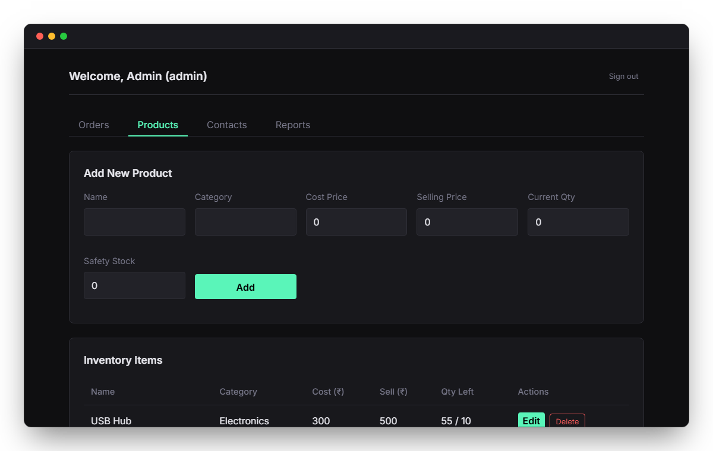
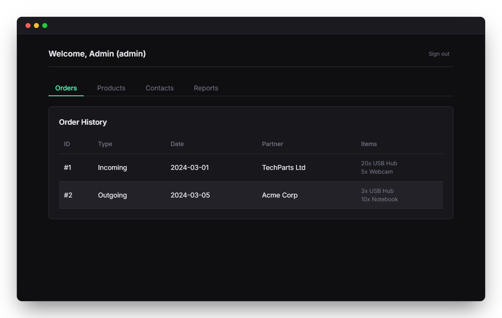
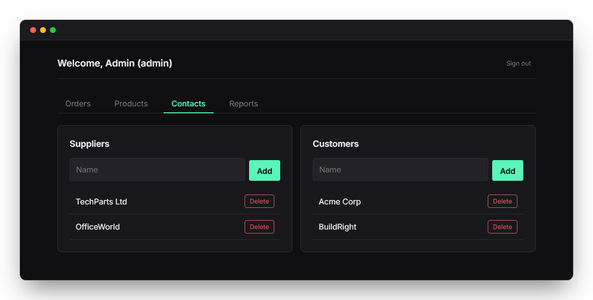
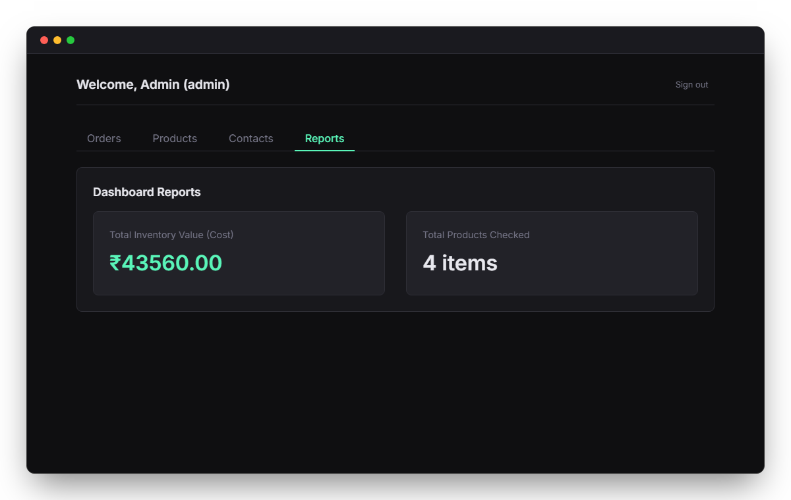
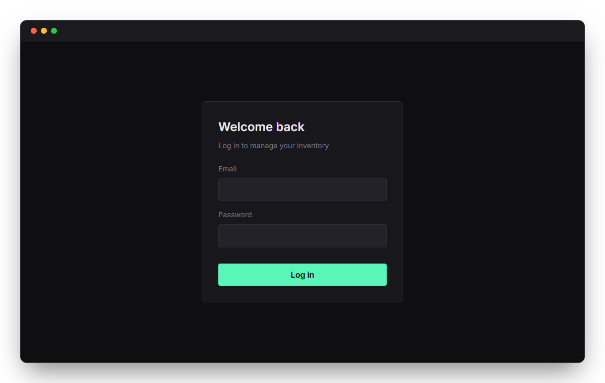

# Inventory Management System

<p align="center">
  
</p>

A role-based web application for tracking stock, recording orders, and managing supplier and customer contacts.

**Stack:** Flask · SQLite · Vue 3 (Vite)

---

## Project Structure

```
inventory-management-system/
├── backend/
│   └── routes/
└── frontend/
    └── src/
        ├── components/
        ├── composables/
        ├── router/
        ├── utils/
        └── views/
```

---

## Routes

| Path               | View           | Description                       |
| ------------------ | -------------- | --------------------------------- |
| `/`                | `LoginView`    | Login page                        |
| `/orders`          | `OrdersView`   | Manage incoming & outgoing orders |
| `/products`        | `ProductsView` | Manage products and stock levels  |
| `/contacts`        | `ContactsView` | Manage suppliers and customers    |
| `/reports`         | `ReportsView`  | Overview of inventory value       |

### API endpoints

#### Auth
| Method   | URL                    | Description              |
| -------- | ---------------------- | ------------------------ |
| `POST`   | `/api/register`        | Create account           |
| `POST`   | `/api/login`           | Log in                   |
| `POST`   | `/api/logout`          | Log out                  |
| `GET`    | `/api/whoami`          | Current user info        |

#### Products
| Method   | URL                    | Description              |
| -------- | ---------------------- | ------------------------ |
| `GET`    | `/api/products`        | List all products        |
| `POST`   | `/api/products`        | Create a product         |
| `PUT`    | `/api/products/<id>`   | Update a product         |
| `DELETE` | `/api/products/<id>`   | Delete a product         |

#### Orders
| Method   | URL                    | Description              |
| -------- | ---------------------- | ------------------------ |
| `GET`    | `/api/orders`          | List all orders          |
| `POST`   | `/api/orders`          | Create an order          |

#### Contacts
| Method   | URL                    | Description              |
| -------- | ---------------------- | ------------------------ |
| `GET`    | `/api/suppliers`       | List all suppliers       |
| `POST`   | `/api/suppliers`       | Create a supplier        |
| `PUT`    | `/api/suppliers/<id>`  | Update a supplier        |
| `DELETE` | `/api/suppliers/<id>`  | Delete a supplier        |
| `GET`    | `/api/customers`       | List all customers       |
| `POST`   | `/api/customers`       | Create a customer        |
| `PUT`    | `/api/customers/<id>`  | Update a customer        |
| `DELETE` | `/api/customers/<id>`  | Delete a customer        |

---

## Running the Application

### Backend

```bash
cd backend
pip install -r requirements.txt
python app.py
```

Runs on `http://localhost:5000`. On first run, creates the database and seeds demo data.


### Frontend

```bash
cd frontend
npm install
npm run dev
```

Runs on `http://localhost:5173`.

---

## Screenshots

Path: `/orders` — Admin Orders


Path: `/products` — Admin Products


Path: `/contacts` — Admin Contacts


Path: `/reports` — Admin Reports


Path: `/orders` — Manager Orders


Path: `/` — Login page

